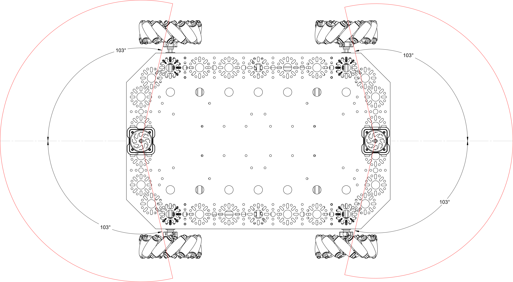

# lidar_merge_cpp

Merges the front and back YDLidar Tmini Plus scans into a single 360° `/scan`
topic. Also provides a `confidence_scan_gate_node` that filters `/scan` into
`/scan_filtered` for SLAM quality control.

Used by all drive packages — `lidar_merge.launch.py` is included by every
`mapping.launch.py`, `navigation.launch.py`, and `route_navigation.launch.py`.

## Architecture

```
/dev/ttyUSB0 → ydlidar_ros2_driver (front_lidar) → /front/scan ─┐
                                                                   ├──→ lidar_merge_node → /scan
/dev/ttyUSB1 → ydlidar_ros2_driver (back_lidar)  → /back/scan  ─┘
                                                                        │
                                                                        └──→ confidence_scan_gate_node → /scan_filtered
```

## Lidar orientation (CRITICAL)

Both lidars are configured with `reversion: true` and `inverted: true` in their
driver params. This makes **scan angle 0° point outward** (away from the robot
body) for both units.

- **Front lidar**: mounted at +x, `yaw = 0` — 0° already points forward.
- **Back lidar**: mounted at −x, `yaw = π` — rotated so 0° points backward.

This is the **opposite** of the cable-exit-inward assumption. Do not change
these without re-testing on the physical robot.

## TF tree

```
base_link
├── front_lidar   x=+0.19195 m  z=0.1083 m  yaw=0
├── back_lidar    x=−0.19195 m  z=0.1083 m  yaw=π
└── base_scan     x=0  y=0  z=0.1083 m  yaw=0   ← merged /scan output frame
```

`base_scan` sits at the physical lidar height (0.1083 m) so the merged scan
aligns visually with the individual scans in RViz.

## Merge algorithm

The merger bins all incoming rays into a polar histogram at configurable
angular resolution. Each input scan contributes its outward-facing arc only —
rays that would look back through the robot body are discarded.

**Valid arc filter**: each lidar contributes ±`valid_half_angle_deg` (default
103°) around its 0° direction. Points outside this window are dropped.



**Noise filters** (`config/params.yaml`):

| Parameter | Default | Effect |
|---|---|---|
| `min_intensity` | 0.0 (off) | Skip rays below this intensity — helps with glass/reflective surfaces |
| `min_neighbors` | 1 | Remove output bins with no close neighbour — kills isolated ghost points |
| `neighbor_window_deg` | 2.0 | Angular search window for neighbour check |
| `neighbor_dist_tol` | 0.3 m | Max range difference to count as a neighbour |

Tune `min_intensity` (try 100–200) if reflective surfaces cause noise clusters.
Raise `min_neighbors` to 2 if isolated noise persists after intensity filtering.

## Confidence scan gate

`confidence_scan_gate_node` subscribes to `/scan` and publishes `/scan_filtered`.
It applies three filters:

1. **Motion gate** — drops the entire scan if angular velocity exceeds
   `max_angular_speed` (prevents motion blur during fast turns).
2. **Overlap gate** — discards rays where front and back lidars have conflicting
   readings at the same angle (removes double-counting artefacts at the seams).
3. **Ghost wall filter** — removes rays that are suspiciously consistent with
   nearby map walls but further away (helps with glass/mirror reflections).

The confidence gate is used **for SLAM only** (`mapping.launch.py`). It is
intentionally excluded from `navigation.launch.py` and `route_navigation.launch.py`
because its motion gate starves AMCL during Nav2 turns, causing the
`map→odom` TF to freeze. AMCL handles noisy scans gracefully without filtering.

## Topics

| Topic | Type | Description |
|---|---|---|
| `/front/scan` | `sensor_msgs/LaserScan` | Front YDLidar raw scan |
| `/back/scan` | `sensor_msgs/LaserScan` | Back YDLidar raw scan |
| `/scan` | `sensor_msgs/LaserScan` | Merged 360° scan (frame: `base_scan`) |
| `/scan_filtered` | `sensor_msgs/LaserScan` | Confidence-gated scan for SLAM |

> **RViz QoS**: YDLidar topics use **Best Effort** reliability. Set this on
> LaserScan displays in RViz or they will receive nothing.

## Build

```bash
colcon build --packages-select lidar_merge_cpp
source install/setup.bash
```

## Run standalone

```bash
ros2 launch lidar_merge_cpp lidar_merge.launch.py
```

Check merged scan rate:

```bash
ros2 topic hz /scan
ros2 topic hz /front/scan
ros2 topic hz /back/scan
```
